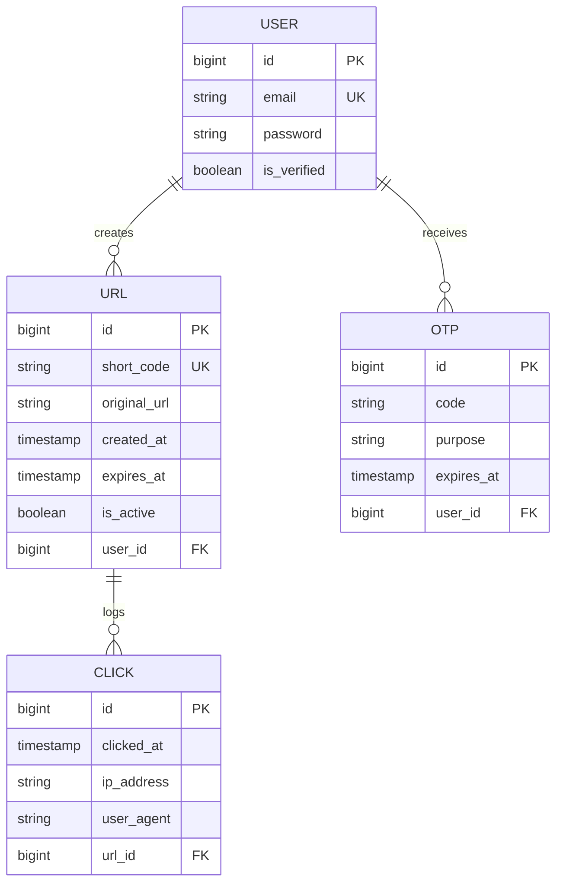

# Shrtn: URL Shortener Monorepo

A high-performance URL shortening application consisting of a React + Vite frontend and a Spring Boot API backend. Designed for speed, responsiveness, and horizontal scalability.

## Tech Stack

*   **Frontend:** React 19, TypeScript, Vite 8, Tailwind CSS v4, Framer Motion, Recharts
*   **Backend:** Java 17, Spring Boot 3.x, Spring Security (JWT)
*   **Database:** PostgreSQL (Spring Data JPA)
*   **Cache:** Redis (Spring Data Redis)

---

## Architecture & System Design

### 1. Database Schema

The relational database model persists user accounts, base62 short code mappings, dynamic verification OTPs, and clicks audit trails:



### 2. Redirection & Caching Flow

To minimize latency on public redirects and reduce primary database load, Redis acts as a critical cache layer:

```text
Public Request (GET /{shortCode})
       │
       ▼
 ┌───────────┐  Yes  ┌───────────────┐
 │Cached in  ├──────►│Redirect (302) │
 │  Redis?   │       └───────────────┘
 └─────┬─────┘
       │ No
       ▼
 ┌───────────┐  No   ┌───────────────┐
 │ Exist in  ├──────►│  Error (404)  │
 │    DB?    │       └───────────────┘
 └─────┬─────┘
       │ Yes
       ▼
 ┌───────────┐       ┌───────────────┐       ┌───────────────┐       ┌───────────────┐
 │ Verify    ├──────►│ Cache URL in  ├──────►│ Log click to  ├──────►│Redirect (302) │
 │ Link      │       │ Redis (24h)   │       │ DB (Async)    │       └───────────────┘
 └───────────┘       └───────────────┘       └───────────────┘
```

*   **Redirection Cache:** Cached at `url:{shortCode}` for 24 hours. Bypasses database queries completely for hot links.
*   **Analytics Cache:** Aggregated analytics dashboard payloads are cached at `analytics:{shortCode}`.
*   **Eviction Policy:** Updating a URL state (toggling active status) or deleting a URL immediately evicts the corresponding keys from the cache.

---

## API Reference

All protected endpoints require authorization using bearer tokens: `Authorization: Bearer <JWT_TOKEN>`.

| Method | Endpoint | Description | Auth Required |
|:---|:---|:---|:---|
| **POST** | `/api/v1/auth/register` | Register a new user profile | No |
| **POST** | `/api/v1/auth/verify` | Validate user registration email OTP | No |
| **POST** | `/api/v1/auth/resend-otp` | Request a fresh OTP validation code | No |
| **POST** | `/api/v1/auth/login` | Authenticate user credentials & receive JWT | No |
| **POST** | `/api/v1/auth/forgot-password` | Request recovery OTP code for forgotten password | No |
| **POST** | `/api/v1/auth/reset-password` | Validate recovery OTP & update account password | No |
| **POST** | `/api/v1/users/change-password` | Update current account password | Yes |
| **POST** | `/shorten` | Generate base62 short code for a URL (max 25/user) | Yes |
| **GET** | `/urls` | List all URLs owned by current user | Yes |
| **PATCH**| `/urls/{shortCode}/toggle` | Toggle link redirection active status | Yes |
| **DELETE**| `/urls/{shortCode}` | Evict link & associated logs | Yes |
| **GET** | `/urls/{shortCode}/analytics` | Retrieve browser, OS, and timeline click insights | Yes |
| **GET** | `/{shortCode}` | Public redirection portal | No |

---

## Environment Setup

Create a `.env` configuration file in the `server/` directory:

```env
DB_PASSWORD=            # PostgreSQL DB Password
REDIS_HOST=             # Redis cache host
REDIS_PORT=             # Redis cache port
REDIS_PASSWORD=         # Redis credentials password
JWT_SECRET=             # JWT token sign key (HMAC-SHA256)
MAIL_PASSWORD=          # Gmail SMTP Credentials password
```

---

## Getting Started

### Backend
1. Copy `server/.env.example` to `server/.env` and update parameters.
2. Launch the Spring Boot server:
   ```bash
   cd server && ./gradlew bootRun
   ```

### Frontend
1. Install client node modules:
   ```bash
   cd client && bun install # or npm install
   ```
2. Start the Vite development build server:
   ```bash
   bun run dev # or npm run dev
   ```

---

## License

This project is licensed under the MIT License. See the [LICENSE](file:///home/charan/Documents/UrlShortener/LICENSE) file for details.
