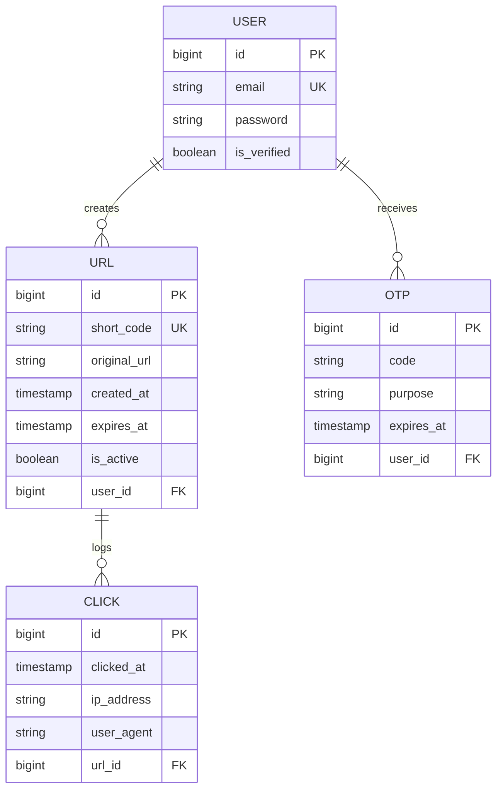

# Shrtn — URL Shortener

A fast, full-stack URL shortener with click analytics, OTP-based auth, and a Redis-backed redirect engine. Live at **[app.shrtn.fun](https://app.shrtn.fun)** — short links resolve via **[shrtn.fun](https://shrtn.fun)**.

## Live URLs

| Service | URL |
|---|---|
| Frontend (Dashboard) | [app.shrtn.fun](https://app.shrtn.fun) |
| Short links | `shrtn.fun/{code}` |
| Backend API | [shrtn.fun](https://shrtn.fun) (Render) |

---

## Tech Stack

| Layer | Technology |
|---|---|
| **Frontend** | React 19, TypeScript, Vite, Tailwind CSS v4, Framer Motion, Recharts |
| **Backend** | Java 25, Spring Boot 4, Spring Security (JWT) |
| **Database** | PostgreSQL (Supabase) via Spring Data JPA |
| **Cache** | Redis (Upstash) via Spring Data Redis |
| **Email** | [Resend](https://resend.com) API (`noreply@shrtn.fun`) |
| **Analytics** | [Umami](https://umami.is) (self-hosted analytics script) |
| **Hosting** | Vercel (frontend) · Render (backend) |

---

## Architecture & System Design

### Redirect Flow

Short links (`shrtn.fun/{code}`) point directly to the Render backend — no frontend hop involved:

```text
User visits shrtn.fun/{code}
        │
        ▼
  ┌───────────┐  Hit   ┌──────────────────┐
  │  Redis    ├───────►│  302 → destination│
  │  Cache?   │        └──────────────────┘
  └─────┬─────┘
        │ Miss
        ▼
  ┌───────────┐  No    ┌──────────────────┐
  │ Exist in  ├───────►│  404 / Inactive  │
  │    DB?    │        └──────────────────┘
  └─────┬─────┘
        │ Yes + Active
        ▼
  Cache in Redis (24h TTL) → Log click async → 302 → destination
```

- **Hot-path cache:** `url:{shortCode}` → original URL, 24h TTL
- **Analytics cache:** `analytics:{shortCode}` — evicted on every new click or delete
- **Cache eviction:** toggle or delete immediately purges relevant Redis keys

### Database Schema



---

## API Reference

All protected endpoints require `Authorization: Bearer <JWT_TOKEN>`.

| Method | Endpoint | Description | Auth |
|:---|:---|:---|:---|
| `POST` | `/api/v1/auth/register` | Register user, send verification OTP | No |
| `POST` | `/api/v1/auth/verify-otp` | Verify email OTP, receive JWT | No |
| `POST` | `/api/v1/auth/resend-otp` | Re-send OTP email | No |
| `POST` | `/api/v1/auth/login` | Login, receive JWT | No |
| `POST` | `/api/v1/auth/forgot-password` | Send password reset OTP | No |
| `POST` | `/api/v1/auth/reset-password` | Reset password with OTP | No |
| `POST` | `/api/v1/users/change-password` | Change current password | Yes |
| `POST` | `/shorten` | Create short link (max 25/user) | Yes |
| `GET` | `/urls` | List all user's links | Yes |
| `PATCH` | `/urls/{shortCode}/toggle` | Toggle link active status | Yes |
| `DELETE` | `/urls/{shortCode}` | Delete link + analytics | Yes |
| `GET` | `/urls/{shortCode}/analytics` | Get click analytics | Yes |
| `GET` | `/{shortCode}` | Public redirect | No |

---

## Environment Setup

### Backend (`server/.env`)

```env
DB_URL=              # PostgreSQL JDBC connection string
DB_USERNAME=         # PostgreSQL username
DB_PASSWORD=         # PostgreSQL password
REDIS_HOST=          # Upstash Redis host
REDIS_PORT=          # Upstash Redis port
REDIS_PASSWORD=      # Upstash Redis password
JWT_SECRET=          # HMAC-SHA256 signing key
RESEND_API_KEY=      # Resend API key (re_...)
CORS_ALLOWED_ORIGINS=https://app.shrtn.fun
```

### Frontend (`client/.env`)

```env
VITE_API_BASE_URL=https://shrtn.fun
VITE_PUBLIC_SHORT_URL_BASE=https://shrtn.fun
```

---

## Getting Started (Local)

### Backend
```bash
cd server
cp .env.example .env   # fill in your values
./gradlew bootRun
```

### Frontend
```bash
cd client
bun install            # or npm install
bun run dev            # or npm run dev
```

---

## License

MIT — see [LICENSE](./LICENSE).
